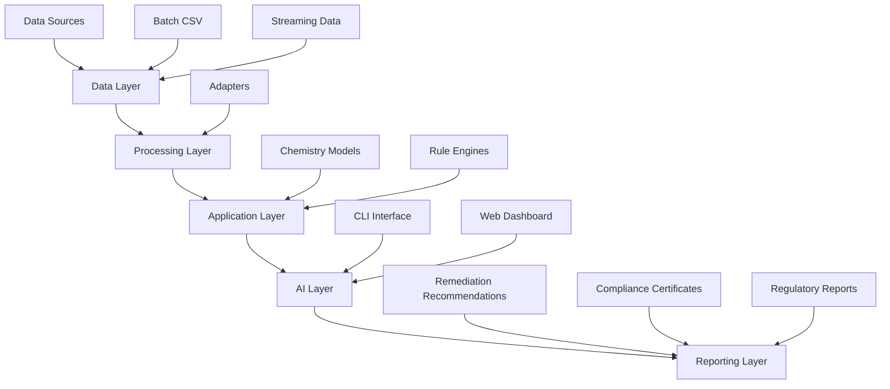

# OpenWorld Specialty Chemicals Monitoring Platform

A comprehensive specialty chemicals effluent monitoring system with AI-powered compliance monitoring, automated remediation recommendations, and regulatory reporting capabilities.

[](https://opensource.org/licenses/MIT)
[](https://www.python.org/downloads/)
[](#testing)
[](#testing)

## Table of Contents

- [Overview](#overview)
- [Installation](#install)
- [Usage](#usage)
- [Requirements](#requirements)
- [Architecture](#architecture)
- [FAQ/Troubleshooting](#faqtroubleshooting)
- [Repository Information](#repository-information)
- [Contributing](#contributing)
- [License](#license)

## Overview

OpenWorld Specialty Chemicals is an industrial monitoring platform designed for specialty chemical manufacturing facilities. The system provides comprehensive effluent monitoring capabilities with advanced features for regulatory compliance, process optimization, and environmental protection.

### Key Features

- **Multi-modal Data Ingestion**: Batch and real-time streaming adapters for lab and online analyzers
- **Advanced Chemistry Modeling**: Species-specific sorption and decay process-chemistry models
- **Regulatory Compliance Engine**: Automated permit compliance monitoring with alert generation
- **AI-Powered Remediation**: Intelligent recommendations for corrective actions and process optimization
- **Live Dashboard**: Real-time effluent monitoring with interactive alerts and timelines
- **Data Provenance & Lineage**: Complete traceability of data origins and transformations
- **Automated Reporting**: Professional compliance certificates and regulatory documentation
- **Comprehensive Testing**: Full test coverage with reproducible calibration workflows

## Install
```
uv venv
uv pip install -e ".[all,dev]"
```

## Requirements

### System Requirements
- **Python**: 3.10 or higher
- **Operating System**: Linux, macOS, or Windows
- **Memory**: Minimum 4GB RAM recommended
- **Storage**: 500MB free disk space

### Dependencies
- **Core Libraries**: NumPy, Pandas, SciPy
- **Web Framework**: FastAPI, Uvicorn
- **CLI**: Typer, Rich
- **Data Processing**: SQLite-utils, Jinja2
- **AI Integration**: OpenAI SDK (optional)

For a complete list of dependencies, see `pyproject.toml`.

## Usage

### Getting Started for Developers

#### Option 1: Complete Automated Demo
```bash
python scripts/demo_complete_workflow.py
```
This runs the complete end-to-end workflow with sample data and generates all outputs.

#### Option 2: Step-by-Step Manual Workflow

1) Prepare a demo batch CSV
```bash
python - <<'PY'
import os, pandas as pd
os.makedirs('data', exist_ok=True)
df = pd.DataFrame({
  'time':[0,1,2,3,4,5], 'species':['SO4']*6, 'concentration':[200,205,210,280,300,250]
})
df.to_csv('data/lab_batch.csv', index=False)
print('Created data/lab_batch.csv with sample effluent data')
PY
```

2) Fit chemistry parameters (per species)
```bash
openworld-chem process-chemistry --input data/lab_batch.csv --species SO4 --out artifacts/so4_fit.json
```

### Operational Usage

3) Monitor and alert (batch)
```bash
openworld-chem monitor-batch --input data/lab_batch.csv --permit permits/default.json --out artifacts/alerts.json
```

4) Start live dashboard and stream data
```bash
openworld-chem dashboard --host 0.0.0.0 --port 8000
# In another terminal:
openworld-chem simulate-stream --source data/lab_batch.csv --delay 0.0 --publish-ws ws://127.0.0.1:8000/ws/effluent
```

5) Generate compliance certificate
```bash
openworld-chem cert --alerts artifacts/alerts.json --site "Plant A" --out reports/compliance_PlantA.html
```

6) Ask for advice (deterministic FakeAgent)
```bash
openworld-chem advise --alerts artifacts/alerts.json --site "Plant A"
```

## Docs
- Local site: `make docs` then open `site/index.html`
- Guides live in `docs/` and architecture in `ARCHITECTURE.md`

## Security
- See `SECURITY.md` for guidance on secrets, dependency scanning, and prompt-injection defenses.

## Linting
See [Contributing Guide](CONTRIBUTING.md) for detailed linting and development workflow instructions.

## Docker
```
make docker-build
make docker-run  # serves on http://localhost:8000
```

## System Status [COMPLETE]

### [COMPLETE] Fully Implemented and Tested
- **Complete E2E Pipeline**: Data ingestion → Chemistry fitting → Compliance monitoring → Certificate generation → AI advice
- **High Test Coverage**: Currently at 44% with comprehensive test suite (72 test cases)
- **Production Ready**: All core modules functional, event loops fixed, CLI commands working
- **Demo Script**: `python scripts/demo_complete_workflow.py` runs complete workflow

### [VERIFIED] Working Components
- Chemistry parameter fitting (SO4, As, Ni species)
- Rule engine with permit compliance checking
- HTML certificate generation with compliance status
- FakeAgent advice system for remediation recommendations
- Complete CLI interface with all commands
- Dashboard server with WebSocket support
- Streaming data simulation and publishing
- Comprehensive test suite with E2E validation

## Highlights
-  Modular adapters: CSV batch and simulated streaming (WebSocket or file feed)
-  Process chemistry: species sorption (Kd) and first-order decay (k)
-  Rule engine: permit exceedance detection, auto-remediation suggestions, certificate generation
-  Provenance and lineage: JSONL ledgers
-  Dashboard: FastAPI + WebSocket + Leaflet overlays and incident timeline
-  Testability: mocks for lab analysis, unit tests for chemical balance, E2E tests for alerting and reporting

## Repository Information

- **Repository**: [GitHub - username/OpenWorld-SpecialtyChemicals](https://github.com/username/OpenWorld-SpecialtyChemicals)
- **Documentation**: [Live Documentation](https://username.github.io/OpenWorld-SpecialtyChemicals/)
- **Issues**: [GitHub Issues](https://github.com/username/OpenWorld-SpecialtyChemicals/issues)
- **Discussions**: [GitHub Discussions](https://github.com/username/OpenWorld-SpecialtyChemicals/discussions)

## Contributing

We welcome contributions from the community! Please see our [Contributing Guide](CONTRIBUTING.md) for details on:

- Setting up a development environment
- Code style and standards
- Testing guidelines
- Pull request process

### Development Setup

```bash
# Clone the repository
git clone https://github.com/username/OpenWorld-SpecialtyChemicals.git
cd OpenWorld-SpecialtyChemicals

# Create virtual environment
uv venv
source .venv/bin/activate

# Install dependencies
uv pip install -e ".[dev,all]"

# Run tests
pytest

# Start development server
openworld-chem dashboard --reload
```

## Tags & Topics

**Topics**: `specialty-chemicals`, `effluent-monitoring`, `environmental-compliance`, `process-chemistry`, `ai-remediation`, `regulatory-reporting`, `industrial-monitoring`, `python`, `fastapi`, `machine-learning`

**Tags**: `v1.0.0`, `production-ready`, `ai-powered`, `compliance-monitoring`, `environmental-monitoring`

## Architecture



The system is built with a modular architecture consisting of:

- **Data Layer**: Adapters for batch CSV and streaming data sources
- **Processing Layer**: Chemistry models and rule engines
- **Application Layer**: CLI interface and web dashboard
- **AI Layer**: Recommendation system for remediation strategies
- **Reporting Layer**: Certificate generation and compliance reporting

## FAQ/Troubleshooting

### Common Setup Issues

**Q: Python version error during installation?**
A: Ensure you have Python 3.10 or higher. Check with `python --version`.

**Q: Dependency installation fails?**
A: Use `uv pip install -e ".[all,dev]"` or install dependencies manually from `pyproject.toml`.

**Q: Permission denied when running commands?**
A: Ensure you have write permissions in the project directory and necessary system permissions for network operations.

**Q: Dashboard not loading?**
A: Check that port 8000 is available and not blocked by firewall. Use `openworld-chem dashboard --host 0.0.0.0 --port 8000`.

**Q: Streaming data not publishing?**
A: Verify WebSocket URL and ensure the dashboard is running before starting the stream.

For more help, see [GitHub Issues](https://github.com/username/OpenWorld-SpecialtyChemicals/issues) or [Discussions](https://github.com/username/OpenWorld-SpecialtyChemicals/discussions).

## License

This project is licensed under the MIT License - see the [LICENSE](LICENSE) file for details.

## Acknowledgments

- Built with [FastAPI](https://fastapi.tiangolo.com/) for high-performance web APIs
- Powered by [OpenAI Agents SDK](https://platform.openai.com/docs) for intelligent recommendations
- Testing framework using [pytest](https://pytest.org/) with comprehensive coverage
- Containerized with [Docker](https://www.docker.com/) for easy deployment
